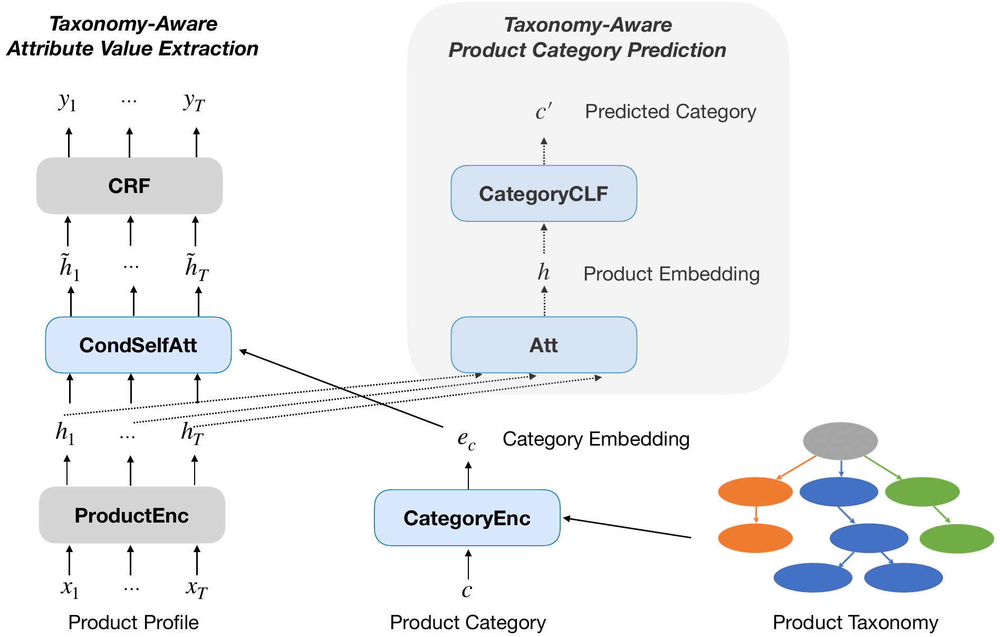

# TXtract
 
A Pytorch implementation of ["TXtract: Taxonomy-Aware Knowledge Extraction for Thousands of Product Categories"](https://arxiv.org/abs/2004.13852) (ACL 2020).

> This paper is an improvement on ["OpenTag: Open Attribute Value Extraction from Product Profiles"](https://arxiv.org/pdf/1806.01264.pdf). 

### Structure of the model

### Update
- March 2022: OpenTag-2018 model (Bert-Bilstm-SeqSelfAttention-CRF)

### Requirement

### Data

### Model

### How to use the code